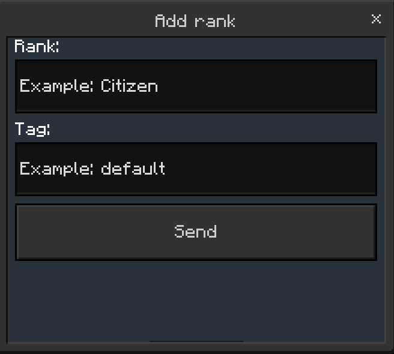
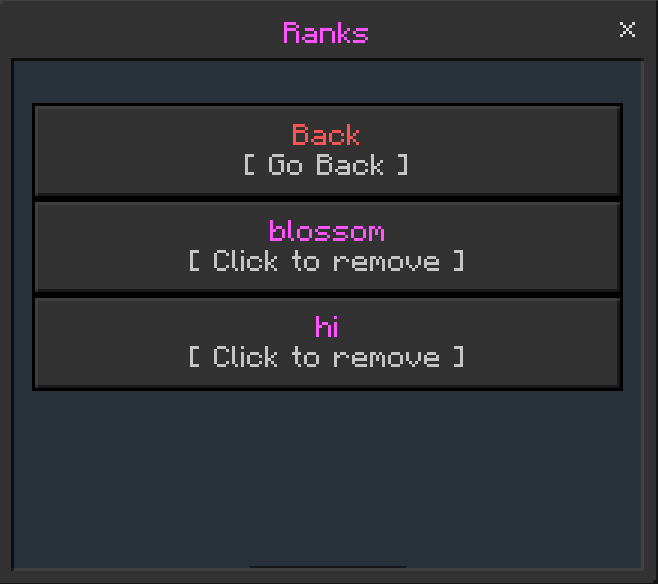

# Ranks

Ranks is one of the most complicated features in Simple Essentials, so this page will guide you through it!#

----------------------------------------------------

## Adding ranks

To add a rank, go to the Ranks UI and click "add"

| Option                 | Description                    |
| ------------------- | ------------------------------ |
| `Display`                | The display of the rank in chat        |
| `Tag`                | The tag you will give the person to give them the rank       |

-------------------------------

-------------------------------

## Removing ranks

Removing ranks is easy. Just navigate to the Ranks UI then click `Remove`. Then, you can click the rank you want to remove (Will display with tag)

---------------------------

---------------------------

# Adding ranks to players

Do `/tag *player* add *tag that you set*` to add ranks to players.

---------------------------

# Remove a rank from a player

Just do `/tag *player* remove *tag that you set*`
